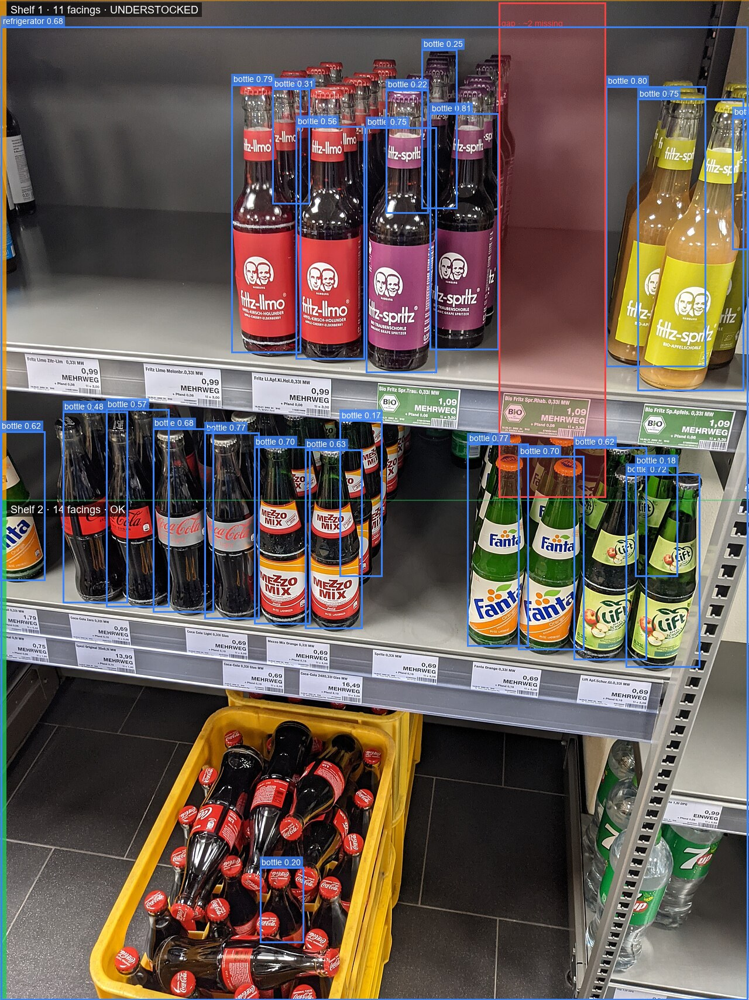

# Retail Shelf Analytics


Computer-vision pipeline that turns a single shelf photo into a stocking report — it detects every product facing, groups them into shelf regions, measures occupancy, and flags empty or under-stocked spaces automatically.


*Real output of this pipeline — no mockups. Two shelves, 25 detected facings, one flagged as under-stocked with an estimated gap of two missing bottles.*

---

## Table of contents

- [Overview](#overview)
- [Key features](#key-features)
- [Live demo](#live-demo)
- [Architecture](#architecture)
- [How shelf-region grouping works](#how-shelf-region-grouping-works)
- [Tech stack](#tech-stack)
- [Project structure](#project-structure)
- [Getting started](#getting-started)
- [API reference](#api-reference)
- [Configuration](#configuration)
- [Testing](#testing)
- [Sample data](#sample-data)
- [Limitations and production notes](#limitations-and-production-notes)
- [License](#license)

---

## Overview

A merchandiser walking a store aisle can tell at a glance that a shelf is half-empty — a camera cannot, unless something turns pixels into structure. This project is a self-contained pipeline that does exactly that: given a single photograph of a shelf, it detects every product on it, works out which shelf each product belongs to, and reports facing counts, occupancy percentages, and specific stock gaps — the kind of report a store-operations team could act on directly.

The system is split into two independently deployable pieces:

- **Backend** — a FastAPI service that runs YOLOv8 object detection, applies the shelf-region post-processing logic, renders an annotated image, and returns a typed JSON report.
- **Frontend** — a React + TypeScript single-page app where a user uploads a photo, tunes detection parameters, and reviews the annotated result alongside a compliance summary.

## Key features

- **Object detection with YOLOv8** — configurable confidence and IoU thresholds, CPU-friendly by default.
- **Shelf-region grouping** — detections are grouped into horizontal shelf bands using either dynamic clustering or a fixed shelf count, computed from the geometry of the detections themselves.
- **Occupancy and gap analysis** — every region gets an occupancy ratio, a per-shelf status (`ok` / `understocked` / `empty`), and a list of specific horizontal gaps with an estimated count of missing facings.
- **Annotated image rendering** — bounding boxes, shelf-region bands, and gap highlights are drawn server-side and returned as a base64 PNG, so the frontend never touches image processing.
- **JSON compliance report** — the full structured result can be downloaded directly from the UI for further analysis or integration into another system.
- **Typed end-to-end** — Pydantic models on the backend and matching TypeScript interfaces on the frontend, so the API contract is enforced on both sides.

## Live demo

The screenshots below are the actual application, running locally against the FastAPI backend — not design mockups.

**Upload screen** — drag-and-drop with live threshold controls:


**Analysis result** — annotated image, compliance summary, and per-shelf breakdown, rendered from a real API response:


A second, denser example — a six-shelf sauce aisle — shows how the pipeline behaves under harder conditions: partial occlusion, a strong camera angle, and a shelf where the general-purpose detector genuinely misses products (discussed in [Limitations](#limitations-and-production-notes)):


## Architecture


The request path is a straight pipeline — each stage only depends on the one before it, which is what keeps the modules independently testable:

1. **Upload** — the React app posts the image as `multipart/form-data` to `POST /api/analyze`, along with confidence, IoU, and an optional expected-shelf-count query parameter.
2. **Decode** — FastAPI reads the upload into memory and decodes it with OpenCV.
3. **Detection** (`app/detection.py`) — a YOLOv8 model (Ultralytics), loaded once as a process-wide singleton, returns bounding boxes, confidence scores, and class labels.
4. **Shelf analysis** (`app/shelf_analysis.py`) — pure-Python geometry groups detections into shelf regions, computes an occupancy ratio per region, and flags horizontal gaps between facings. This module has no dependency on YOLO or FastAPI, so it is fully unit-testable with synthetic detections.
5. **Annotation** (`app/annotation.py`) — Pillow draws bounding boxes, shelf-status bands, and gap highlights directly onto the original image.
6. **Response** — a single `AnalysisReport` (Pydantic model) carrying the annotated image, the per-shelf breakdown, and a compliance summary is returned as JSON.
7. **Render** — the frontend renders the annotated image, a compliance dashboard, and a per-shelf table, all typed against the same response shape.

## How shelf-region grouping works

Turning a flat list of bounding boxes into "shelf 1 has 11 facings and is understocked" is the actual engineering problem here — YOLO only sees objects, not shelves. Two strategies are implemented in `group_into_shelf_regions`:

- **Dynamic clustering (default)** — detections are sorted by vertical center and split into rows wherever the vertical gap between consecutive detections exceeds a configurable multiple of the median box height. This adapts naturally to shelves photographed at a slight angle or with uneven spacing, but it has one blind spot: a shelf with zero detections produces no data point to cluster, so it cannot be told apart from "no shelf at all."
- **Fixed bands** (`expected_shelf_count` parameter) — the image is split into that many equal-height horizontal bands up front, and detections are assigned to the band their center falls into. This is the only way to flag a shelf as completely `empty`, since an empty band is still a region — at the cost of assuming the shelves are evenly spaced in the frame.

Within each region, facings are sorted left to right and the horizontal distance between neighboring boxes is compared against a multiple of the average facing width. A distance beyond that threshold is recorded as a `StockGap`, with an estimated missing-facing count derived from how many average-width products would fit in it. Occupancy is then simply the filled width over filled-plus-gap width — a metric that is easy to explain to a non-technical stakeholder, which matters as much as its precision.

## Tech stack

| Layer | Choice | Why |
|---|---|---|
| Object detection | YOLOv8 (Ultralytics), COCO-pretrained `yolov8n` | Fast on CPU, no training required to get a working demo; swappable for a fine-tuned checkpoint |
| Backend framework | FastAPI + Pydantic | Async-ready, automatic OpenAPI docs, request/response validation for free |
| Image processing | OpenCV + Pillow | OpenCV for decoding, Pillow for readable, layered annotation drawing |
| Frontend framework | React 18 + TypeScript | Typed components, matches the backend's typed contract |
| Build tooling | Vite | Fast dev server and a minimal, dependency-light production build |
| Testing | pytest | The shelf-analysis logic is pure geometry and is tested without any model dependency |

## Project structure

```
Task12/
├── backend/
│   ├── app/
│   │   ├── main.py             # FastAPI app and the /api/analyze endpoint
│   │   ├── detection.py        # YOLOv8 wrapper (ShelfDetector)
│   │   ├── shelf_analysis.py   # Region grouping, occupancy, gap detection
│   │   ├── annotation.py       # Draws boxes, region bands, and gaps
│   │   ├── schemas.py          # Pydantic response models (API contract)
│   │   └── config.py           # Environment-driven settings
│   ├── tests/
│   │   └── test_shelf_analysis.py
│   ├── sample_data/            # Demo shelf photos + generated outputs
│   ├── requirements.txt
│   └── Dockerfile
├── frontend/
│   ├── src/
│   │   ├── api/analyzeApi.ts       # Typed fetch wrapper for the backend
│   │   ├── components/             # UploadPanel, AnnotatedImageView, ShelfSummaryTable, ...
│   │   ├── types/analysis.ts       # TypeScript mirror of the backend schemas
│   │   └── App.tsx
│   ├── package.json
│   └── Dockerfile
├── docs/
│   ├── architecture.svg
│   └── screenshots/
├── docker-compose.yml
└── README.md
```

## Getting started

### Prerequisites

- Python 3.11+ (tested on 3.13)
- Node.js 18+
- ~200 MB free disk space on first run (PyTorch + the YOLOv8 weights download automatically)

### Backend

```bash
cd backend
python -m venv .venv
source .venv/Scripts/activate        # on Windows (Git Bash); use .venv/bin/activate on macOS/Linux
pip install -r requirements.txt

cp .env.example .env                 # optional — defaults work out of the box

uvicorn app.main:app --reload --port 8000
```

The first request that triggers detection will download `yolov8n.pt` (~6 MB) automatically. Once running, interactive API docs are available at `http://localhost:8000/docs`.

### Frontend

```bash
cd frontend
npm install

cp .env.example .env                 # points VITE_API_BASE_URL at the backend

npm run dev
```

Open `http://localhost:5173`, upload a shelf photo, and adjust the confidence, IoU, and expected-shelf-count controls to see how the analysis changes in real time.

### Docker

```bash
docker compose up --build
```

This builds and runs both services — the backend on port `8000`, the frontend (served by Nginx) on port `8080`.

## API reference

### `POST /api/analyze`

Accepts a shelf photo and returns the full analysis report.

**Query parameters**

| Name | Type | Default | Description |
|---|---|---|---|
| `confidence` | float (0–1) | `0.35` | Minimum detection confidence to keep |
| `iou` | float (0–1) | `0.45` | IoU threshold used for non-max suppression |
| `expected_shelf_count` | int (1–20), optional | none | If set, uses fixed-band grouping (see [above](#how-shelf-region-grouping-works)) and can detect fully empty shelves |

**Body**: `multipart/form-data` with a single `file` field (JPEG, PNG, or WEBP, ≤15 MB).

**Response** — `200 OK`

```json
{
  "image_width": 1280,
  "image_height": 1707,
  "config": { "confidence_threshold": 0.15, "iou_threshold": 0.45, "...": "..." },
  "shelf_regions": [
    {
      "region_id": 0,
      "facing_count": 11,
      "occupancy_ratio": 0.86,
      "status": "understocked",
      "gaps": [
        { "x_start": 852.9, "x_end": 1036.0, "width_px": 183.1, "estimated_missing_facings": 2 }
      ],
      "detections": ["... one entry per detected facing ..."]
    }
  ],
  "compliance": {
    "total_regions": 2,
    "ok_regions": 1,
    "understocked_regions": 1,
    "empty_regions": 0,
    "overall_occupancy_ratio": 0.93,
    "total_facings": 25,
    "total_estimated_missing_facings": 2
  },
  "annotated_image_base64": "iVBORw0KGgoAAAANSU..."
}
```

The full response schema is defined in `backend/app/schemas.py` and mirrored in `frontend/src/types/analysis.ts`. A worked example is available in `backend/sample_data/output/shelf_soda_bottles_report.json`.

### `GET /api/health`

Returns `{"status": "ok"}` — used for container health checks.

## Configuration

Backend settings are read from environment variables (or `backend/.env`), all prefixed with `SHELF_`:

| Variable | Default | Description |
|---|---|---|
| `SHELF_YOLO_MODEL_PATH` | `yolov8n.pt` | Path or name of the YOLO checkpoint to load |
| `SHELF_DEVICE` | `cpu` | Inference device (`cpu`, `cuda`, `mps`, …) |
| `SHELF_DEFAULT_CONFIDENCE` | `0.35` | Default confidence threshold if not passed per-request |
| `SHELF_DEFAULT_IOU` | `0.45` | Default IoU threshold if not passed per-request |
| `SHELF_ROW_GAP_FACTOR` | `1.6` | Vertical gap multiplier that splits dynamic clustering into rows |
| `SHELF_GAP_WIDTH_FACTOR` | `1.35` | Horizontal gap multiplier that flags a stock gap |
| `SHELF_UNDERSTOCKED_OCCUPANCY_THRESHOLD` | `0.75` | Occupancy ratio below which a region is flagged `understocked` |
| `SHELF_MAX_UPLOAD_SIZE_MB` | `15` | Maximum accepted upload size |

The frontend reads a single variable, `VITE_API_BASE_URL`, from `frontend/.env`.

## Testing

The shelf-analysis logic — region grouping, gap detection, occupancy, compliance summary — is pure geometry with no model dependency, so it is covered with fast unit tests using synthetic detections:

```bash
cd backend
source .venv/Scripts/activate
pytest -v
```

## Sample data

`backend/sample_data/` contains two real, third-party shelf photographs (with attribution and license details in `backend/sample_data/CREDITS.md`) and a `generate_samples.py` script that runs the full pipeline against them to produce the annotated PNGs and JSON reports checked into `sample_data/output/` — the same files used as screenshots throughout this README. Run it yourself with:

```bash
cd backend
source .venv/Scripts/activate
python sample_data/generate_samples.py
```

## Limitations and production notes

This project uses the stock, COCO-pretrained `yolov8n` checkpoint — deliberately, so the whole pipeline runs out of the box with no training step. That choice has a real, visible cost, and it is worth being explicit about it rather than hiding it:

- **COCO has one grocery-adjacent class that matters here: `bottle`.** It has no concept of jars, cans, pouches, or boxes, so any shelf stocked with those will under-detect — this is exactly what happens on the `EMPTY` shelf flagged in the sauce-aisle screenshot above, which is not actually empty, it is stocked with jars the model was never trained to recognize.
- **Strong camera angles distort the row-clustering assumption.** Dynamic clustering assumes shelves are roughly horizontal in the frame; a steep angle (as in the sauce-aisle photo) skews vertical centers and can merge or split rows incorrectly.
- **Confidence threshold is a real trade-off, not just a slider.** Lowering it recovers faint detections (as used to reveal the gap in the hero image) but also lets in false positives — there is no single correct value across all photos. The same photo, analyzed twice, makes the point directly:

<table>
<tr>
<th align="center">confidence = 0.15 → gap correctly flagged</th>
<th align="center">confidence = 0.50 → gap silently missed</th>
</tr>
<tr>
<td></td>
<td></td>
</tr>
<tr>
<td align="center">11 facings · <b>understocked</b> · 93% occupancy</td>
<td align="center">6 facings · <b>ok</b> · 100% occupancy</td>
</tr>
</table>

At 0.50, the detector simply never sees the faint bottle silhouettes near the gap, so there is nothing for the gap-detection logic to compare against — the shelf reads as fully stocked when it is not. This is why the threshold is exposed as a first-class, per-request parameter instead of a fixed constant.

For a production deployment, the model is the one component meant to be swapped, not rebuilt around: fine-tune a YOLOv8 checkpoint on a retail-specific dataset (e.g. SKU-110k, or a custom-labeled set of the target store's own products) and point `SHELF_YOLO_MODEL_PATH` at it — every other stage of the pipeline (grouping, occupancy, gap detection, annotation, API contract) is model-agnostic and needs no changes.

## License

The source code is released under the [MIT License](LICENSE). Sample images are third-party photographs used for demonstration only, under their own Creative Commons licenses — see [`backend/sample_data/CREDITS.md`](backend/sample_data/CREDITS.md).
