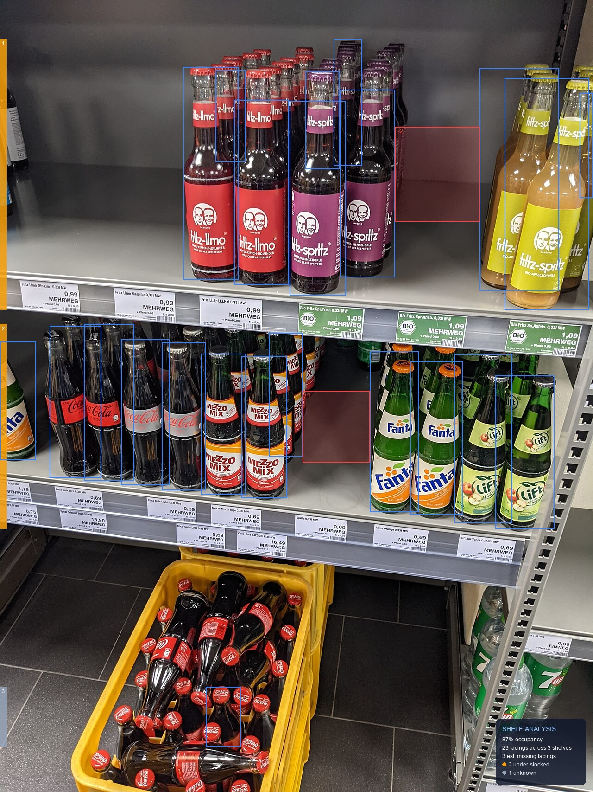
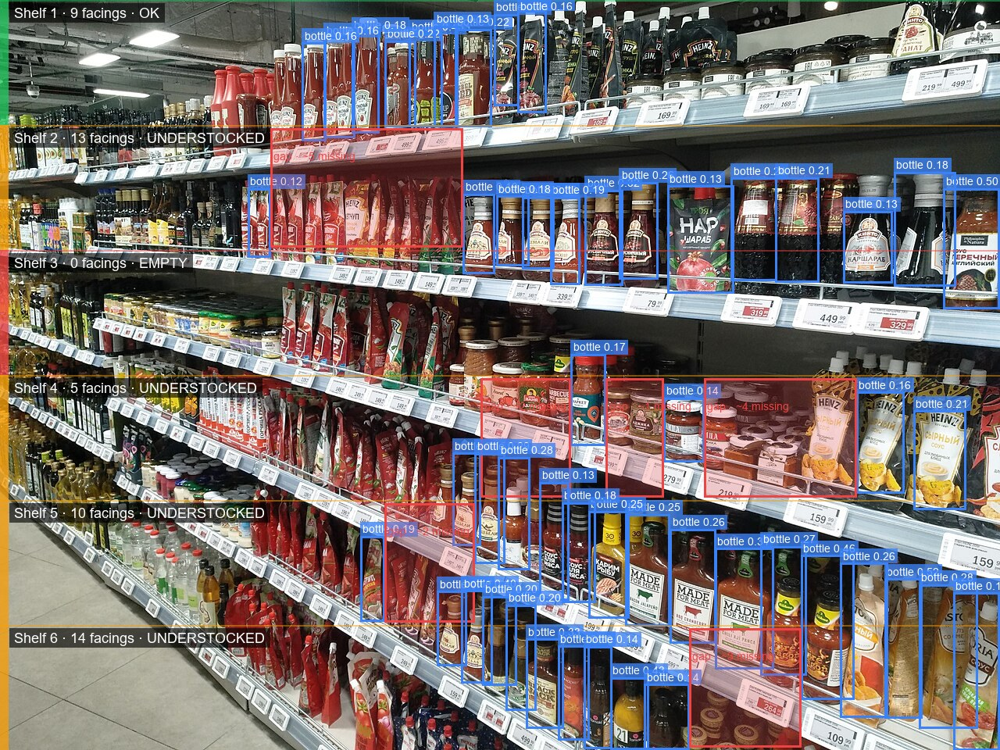
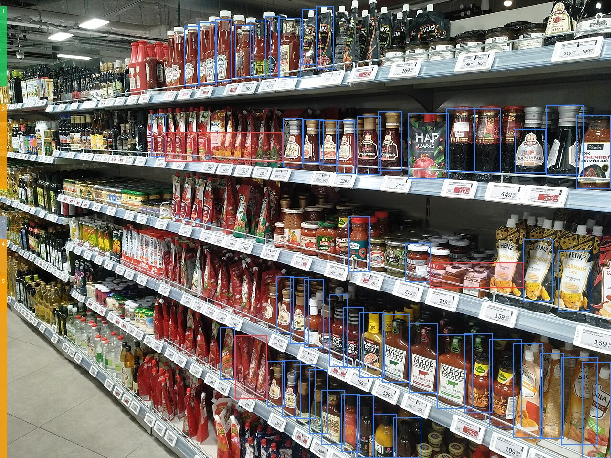
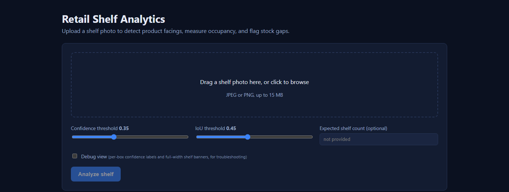
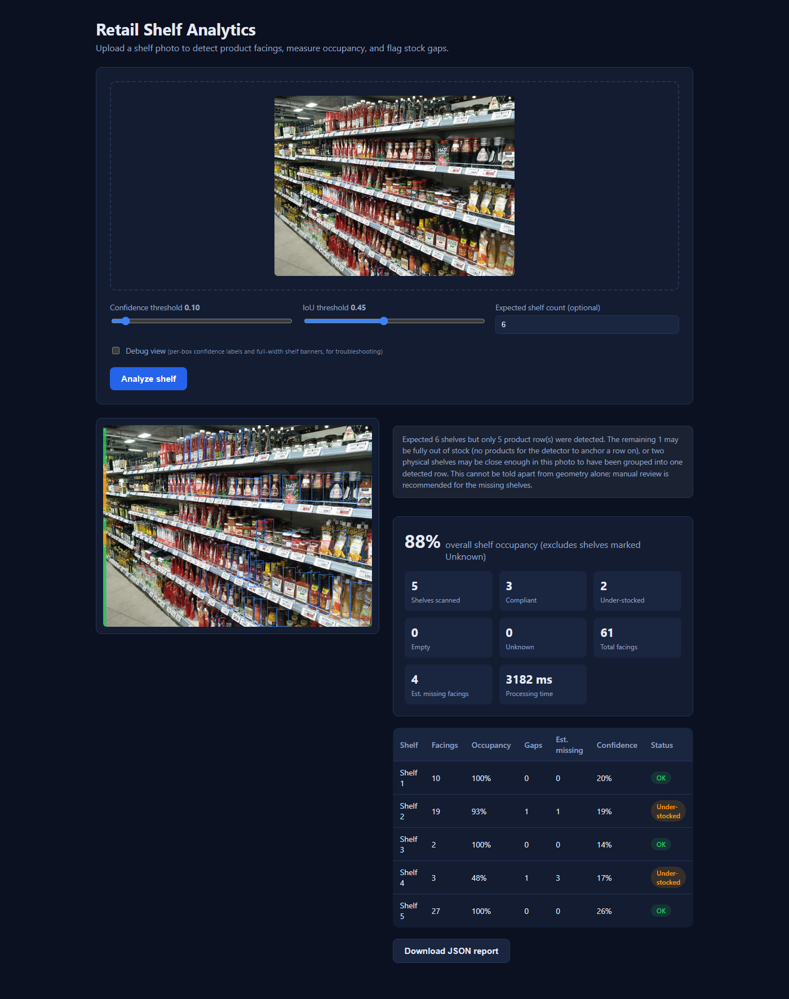
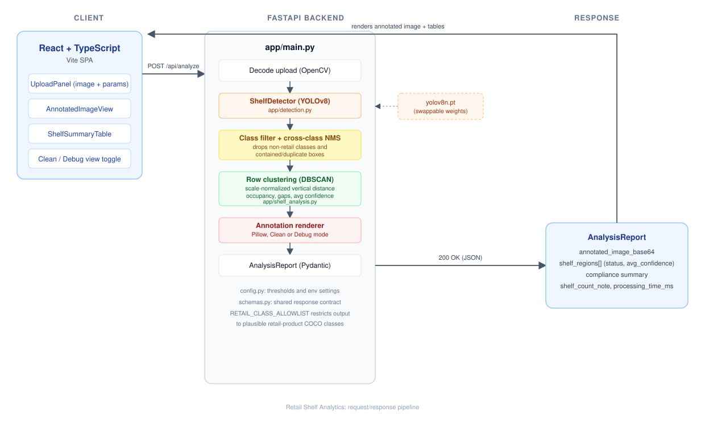

# Retail Shelf Analytics


Detects product facings on a shelf photo, groups them into physical shelf rows, and reports occupancy and stock gaps as a JSON report and an annotated image.


*Actual output of this pipeline (Clean view). Two shelf rows resolved by density-based clustering (22 facings, both real gaps in the photo flagged with an estimated missing-facing count), plus a third region at the bottom (the crate of loose bottles on the floor) correctly reported as `unknown` rather than a confident status.*

## Table of contents

- [What this is and is not](#what-this-is-and-is-not)
- [Before and after](#before-and-after)
- [Live demo](#live-demo)
- [Architecture](#architecture)
- [How shelf row detection works](#how-shelf-row-detection-works)
- [How detection cleanup works](#how-detection-cleanup-works)
- [Tech stack](#tech-stack)
- [Project structure](#project-structure)
- [Getting started](#getting-started)
- [API reference](#api-reference)
- [Configuration](#configuration)
- [Testing](#testing)
- [Evaluation](#evaluation)
- [Prior art and engineering process](#prior-art-and-engineering-process)
- [Limitations](#limitations)
- [Roadmap](#roadmap)
- [License](#license)

## What this is and is not

This project detects products on a shelf photo with a general-purpose YOLOv8 detector, groups the detections into physical shelf rows, and computes an occupancy ratio and a set of stock gaps per row. It is a working demonstration of the full pipeline (detection, row segmentation, gap estimation, annotated rendering, a typed API, and a React frontend), built and tested end to end.

It is **not** a SKU or brand recognition system, and it does **not** use a retail-specific fine-tuned detector. The detector is the stock, COCO-pretrained `yolov8n` checkpoint, whose only class that reliably matches a retail product is `bottle`. This is stated plainly and repeated in [Limitations](#limitations) because it is the single most important fact about what this system can and cannot do; see [Prior art and engineering process](#prior-art-and-engineering-process) for what closing that gap would actually require.

## Before and after

An earlier version of this project used a naive shelf-segmentation strategy: divide the image into a fixed number of equal-height horizontal bands. On a photo shot at a steep angle, that produced a specific, reproducible bug: a band could land on the structural gap between two physical shelves and get reported as `EMPTY`, even when the shelf itself was completely full of product.

<table>
<tr>
<th align="center">Before: equal-height bands (real output, same photo)</th>
<th align="center">After: density-based row clustering (real output, same photo)</th>
</tr>
<tr>
<td></td>
<td></td>
</tr>
<tr>
<td align="center">"Shelf 3, 0 facings, EMPTY" stamped over a fully stocked shelf</td>
<td align="center">Rows follow the actual detections; a row can never be reported empty when products were detected in it</td>
</tr>
</table>

The root cause and the fix are both documented with exact file and line references in [`docs/AUDIT.md`](docs/AUDIT.md), reproduced from the original bug report rather than reconstructed after the fact. The full research pass that led to the fix, including which reference projects were read and which techniques they use, is in [`docs/PRIOR_ART.md`](docs/PRIOR_ART.md).

## Live demo

**Upload screen**, drag and drop with live threshold controls and a Clean/Debug view toggle:



**Analysis result**, rendered from a real API response against the harder of the two bundled sample photos. Note the honest count-mismatch note instead of a fabricated sixth shelf, and the per-shelf confidence column:



## Architecture



1. **Upload**: the React app posts the image as `multipart/form-data` to `POST /api/analyze`, with confidence, IoU, an optional expected-shelf-count hint, and a `debug` flag.
2. **Decode**: FastAPI reads the upload and decodes it with OpenCV.
3. **Detection** (`app/detection.py`): a YOLOv8 model, loaded once as a process-wide singleton, returns bounding boxes, confidence scores, and class labels.
4. **Class filter and cross-class NMS** (`app/detection.py`): output is restricted to a curated allowlist of plausible retail-product COCO classes, and a containment-based pass drops boxes that are mostly swallowed by a larger box of a different class (see [How detection cleanup works](#how-detection-cleanup-works)).
5. **Row clustering** (`app/shelf_analysis.py`): detections are grouped into shelf rows with DBSCAN over a scale-normalized vertical distance, then each row gets an occupancy ratio, a list of stock gaps, an average confidence, and a status.
6. **Annotation** (`app/annotation.py`): Pillow renders the result in Clean view (a compact left-margin status tag, plain boxes, slim gap markers) or Debug view (adds per-box labels and full shelf banners).
7. **Response**: a single `AnalysisReport` (Pydantic model) carries the annotated image, the per-shelf breakdown, a compliance summary, and a processing time.
8. **Render**: the frontend renders the annotated image, a compliance dashboard, and a per-shelf table, typed against the same response shape.

## How shelf row detection works

Rows are found with `DBSCAN` clustering, not by dividing the image into a fixed number of bands. The distance used is not raw pixel distance: it is each pair of detections' vertical center difference divided by their average box height. This makes the clustering scale-invariant across a single photo, which matters because a shelf photographed at an angle has large boxes near the camera and small boxes far from it, so a single global pixel threshold cannot separate rows correctly everywhere in the frame at once. This approach follows the row-grouping method used in `Alijanloo/Retail-Shelf-Monitoring` (see `docs/PRIOR_ART.md`), adapted to a single still image instead of a video pipeline.

A direct and unavoidable consequence: **a row can only be built from detections that exist**. This module cannot report a shelf as `EMPTY`, because there is no detection to anchor an empty region to. This is why the reported bug above cannot recur by construction, and it is also an honest limit: a shelf that is genuinely and completely out of stock looks, from geometry alone, identical to a part of the photo that is not a shelf at all. When an `expected_shelf_count` hint is provided and the number of rows found does not match it, the mismatch is reported in `shelf_count_note` instead of being silently resolved by inventing a row.

Regions built from very few detections (by default, fewer than 2) are reported as `unknown` rather than `ok` or `understocked`, since occupancy and gap statistics are not meaningful from 0 or 1 data points.

## How detection cleanup works

The stock COCO-pretrained checkpoint returns all 80 COCO classes, most of which cannot be a shelf product. Two cleanup steps run after detection, in `app/detection.py`:

1. **Class allowlist**: only classes that can plausibly be a packaged or loose retail product are kept (`bottle`, `cup`, `bowl`, various foods, `book`, `vase`, and similar). Structural and unrelated classes such as `refrigerator`, `person`, or `chair` are dropped.
2. **Cross-class containment suppression**: Ultralytics applies non-max suppression per class, so a large box of one class is never compared against an overlapping box of another class. A box that contains two or more other, mutually non-overlapping boxes is treated as a coarse false positive spanning several real objects and is dropped, keeping its children. A box that contains exactly one other box is resolved by keeping whichever of the two has higher confidence.

Both functions are pure, model-free, and covered directly by unit tests in `backend/tests/test_detection_postprocessing.py`.

## Tech stack

| Layer | Choice | Why |
|---|---|---|
| Object detection | YOLOv8 (Ultralytics), COCO-pretrained `yolov8n` | Runs on CPU with no training step; documented in Limitations as the main accuracy ceiling |
| Row clustering | scikit-learn `DBSCAN`, precomputed scale-normalized distance | Density-based grouping cannot fabricate a row with no supporting detections; see above |
| Backend framework | FastAPI and Pydantic | Async-ready, automatic OpenAPI docs, request and response validation |
| Image processing | OpenCV and Pillow | OpenCV for decoding, Pillow for layered annotation drawing |
| Frontend framework | React 18 and TypeScript | Typed components matching the backend's typed contract |
| Build tooling | Vite | Fast dev server and a small production build |
| Testing | pytest | 18 tests, all pure Python and geometry, no model dependency |

## Project structure

```
Task12/
├── backend/
│   ├── app/
│   │   ├── main.py             # FastAPI app and the /api/analyze endpoint
│   │   ├── detection.py        # YOLOv8 wrapper, class allowlist, containment suppression
│   │   ├── shelf_analysis.py   # DBSCAN row clustering, occupancy, gap detection
│   │   ├── annotation.py       # Clean/Debug rendering
│   │   ├── schemas.py          # Pydantic response models (API contract)
│   │   └── config.py           # Environment-driven settings
│   ├── tests/
│   │   ├── test_shelf_analysis.py
│   │   └── test_detection_postprocessing.py
│   ├── sample_data/            # Demo shelf photos, generated outputs, CREDITS.md
│   ├── requirements.txt
│   └── Dockerfile
├── frontend/
│   ├── src/
│   │   ├── api/analyzeApi.ts
│   │   ├── components/
│   │   ├── types/analysis.ts
│   │   └── App.tsx
│   ├── package.json
│   └── Dockerfile
├── docs/
│   ├── architecture.svg
│   ├── PRIOR_ART.md            # Research pass: 10 reference repos, verified to exist, with citations
│   ├── AUDIT.md                # Root-cause analysis of the original bug, with exact line references
│   ├── EVALUATION.md           # Small, honest manual spot check, explicitly not a benchmark
│   └── screenshots/
├── docker-compose.yml
└── README.md
```

## Getting started

### Prerequisites

- Python 3.11+ (tested on 3.13)
- Node.js 18+
- About 200 MB free disk space on first run (PyTorch and the YOLOv8 weights download automatically)

### Backend

```bash
cd backend
python -m venv .venv
source .venv/Scripts/activate        # on Windows (Git Bash); use .venv/bin/activate on macOS/Linux
pip install -r requirements.txt

cp .env.example .env                 # optional, defaults work out of the box

uvicorn app.main:app --reload --port 8000
```

The first request that triggers detection downloads `yolov8n.pt` (about 6 MB) automatically. Interactive API docs are then available at `http://localhost:8000/docs`.

### Frontend

```bash
cd frontend
npm install

cp .env.example .env                 # points VITE_API_BASE_URL at the backend

npm run dev
```

Open `http://localhost:5173`, upload a shelf photo, and adjust confidence, IoU, and the expected shelf count to see how the analysis changes.

### Docker

```bash
docker compose up --build
```

Runs both services: backend on port `8000`, frontend (served by Nginx) on port `8080`.

## API reference

### `POST /api/analyze`

**Query parameters**

| Name | Type | Default | Description |
|---|---|---|---|
| `confidence` | float (0 to 1) | 0.35 | Minimum detection confidence to keep |
| `iou` | float (0 to 1) | 0.45 | IoU threshold used for non-max suppression |
| `expected_shelf_count` | int (1 to 20), optional | none | Hint for how many shelves the photo shows. Rows are always found from detections; a mismatch is reported in `shelf_count_note`, not silently resolved |
| `debug` | bool | false | Render per-box confidence labels and full-width shelf banners for troubleshooting, instead of the Clean view |

**Body**: `multipart/form-data` with a single `file` field (JPEG, PNG, or WEBP, up to 15 MB).

**Response**, `200 OK`. Real response from a live `POST /api/analyze?confidence=0.15&iou=0.45&expected_shelf_count=2` call against `shelf_soda_bottles.jpg`, with the `detections` arrays and full digits trimmed for length (untrimmed original saved as `backend/sample_data/output/shelf_soda_bottles_clean_report.json`):

```json
{
  "image_width": 1280,
  "image_height": 1707,
  "config": {
    "confidence_threshold": 0.15,
    "iou_threshold": 0.45,
    "dbscan_eps_factor": 0.25,
    "gap_width_factor": 1.35,
    "understocked_occupancy_threshold": 0.75,
    "min_detections_for_confidence": 2
  },
  "shelf_regions": [
    {
      "region_id": 0,
      "facing_count": 10,
      "occupancy_ratio": 0.8517,
      "avg_confidence": 0.5405,
      "status": "understocked",
      "gaps": [{ "x_start": 852.9, "x_end": 1036.0, "width_px": 183.1, "estimated_missing_facings": 2 }]
    },
    {
      "region_id": 1,
      "facing_count": 12,
      "occupancy_ratio": 0.8946,
      "avg_confidence": 0.62,
      "status": "understocked",
      "gaps": [{ "x_start": 653.6, "x_end": 798.7, "width_px": 145.1, "estimated_missing_facings": 1 }]
    },
    {
      "region_id": 2,
      "facing_count": 1,
      "occupancy_ratio": 0.0,
      "avg_confidence": 0.1994,
      "status": "unknown",
      "gaps": []
    }
  ],
  "compliance": {
    "total_regions": 3,
    "ok_regions": 0,
    "understocked_regions": 2,
    "empty_regions": 0,
    "unknown_regions": 1,
    "overall_occupancy_ratio": 0.8731,
    "total_facings": 23,
    "total_estimated_missing_facings": 3
  },
  "shelf_count_note": "Expected 2 shelves but 3 product rows were detected. 1 extra row(s) may mean a single physical shelf was split into two clusters, for example if it holds two visually distinct product groups with a wide gap between them.",
  "processing_time_ms": 2874.2,
  "annotated_image_base64": "iVBORw0KGgoAAAANSUhE..."
}
```

`processing_time_ms` is wall-clock CPU inference time and varies a few hundred milliseconds between runs on the same machine; the value above is from one specific run, saved verbatim in `backend/sample_data/output/shelf_soda_bottles_clean_report.json`. Region 2 is the crate of loose bottles sitting on the floor below the shelving unit in that photo: a single, low-confidence detection, correctly reported as `unknown` rather than a confident status, and correctly not counted toward `expected_shelf_count`. The full schema is in `backend/app/schemas.py` and mirrored in `frontend/src/types/analysis.ts`.

### `GET /api/health`

Returns `{"status": "ok"}`.

## Configuration

Backend settings are read from environment variables (or `backend/.env`), prefixed with `SHELF_`:

| Variable | Default | Description |
|---|---|---|
| `SHELF_YOLO_MODEL_PATH` | `yolov8n.pt` | Path or name of the YOLO checkpoint to load |
| `SHELF_DEVICE` | `cpu` | Inference device (`cpu`, `cuda`, `mps`) |
| `SHELF_DEFAULT_CONFIDENCE` | 0.35 | Default confidence threshold if not passed per request |
| `SHELF_DEFAULT_IOU` | 0.45 | Default IoU threshold if not passed per request |
| `SHELF_CONTAINMENT_SUPPRESSION_THRESHOLD` | 0.85 | Containment fraction above which a box is treated as a duplicate or a false-positive umbrella |
| `SHELF_DBSCAN_EPS_FACTOR` | 0.25 | Row clustering threshold, in units of average box height; tuned against both bundled sample photos, see `docs/AUDIT.md` |
| `SHELF_MIN_DETECTIONS_FOR_CONFIDENCE` | 2 | Regions with fewer detections than this are reported as `unknown` |
| `SHELF_GAP_WIDTH_FACTOR` | 1.35 | Horizontal gap multiplier that flags a stock gap |
| `SHELF_UNDERSTOCKED_OCCUPANCY_THRESHOLD` | 0.75 | Occupancy ratio below which a region is flagged `understocked` |
| `SHELF_MAX_UPLOAD_SIZE_MB` | 15 | Maximum accepted upload size |

The frontend reads one variable, `VITE_API_BASE_URL`, from `frontend/.env`.

## Testing

```bash
cd backend
source .venv/Scripts/activate
pytest -v
```

18 tests across two files, all pure Python with synthetic input, no model or GPU required:

- `test_shelf_analysis.py`: row clustering, the specific "never invent an empty row" guarantee, gap detection, the `unknown` status, the shelf-count mismatch note, and edge cases (zero detections, a single detection, zero-width boxes that previously caused a division-by-zero crash).
- `test_detection_postprocessing.py`: class allowlist filtering and containment suppression, including a direct regression test for the reported "refrigerator box swallowing real bottle boxes" case.

## Evaluation

There is no labeled ground-truth dataset in this project, and no GPU or SKU-110K-scale training run was performed. `docs/EVALUATION.md` is a small, manually reviewed spot check against the two bundled sample photos: a careful visual facing count compared against detected facings (within one unit on both shelves of the easier photo), and a check of whether the two real, visually obvious stock gaps in that photo were flagged (both were, with no false ones). It explicitly states what it does not show: no mAP, precision, or recall figure, since that requires a labeled dataset this environment does not have. Real numbers reported by comparable fine-tuned projects are cited in `docs/PRIOR_ART.md` for context, not as a claim about this project's own detector.

## Prior art and engineering process

This project went through an explicit research and audit pass before the pipeline was changed:

- [`docs/PRIOR_ART.md`](docs/PRIOR_ART.md): ten public repositories, each verified to exist via the GitHub API before being cited, reviewed for their detection architecture, row-grouping method, gap detection, and how honestly they report results.
- [`docs/AUDIT.md`](docs/AUDIT.md): the original bug reproduced with exact numbers (detections bucketed by vertical position, showing genuinely zero detections in the misclassified band even at a lower confidence threshold), traced to specific lines of code, with every other defect found during the same pass (missing cross-class NMS, per-box label clutter, full-width status banners drawn over products, oversized gap rectangles) documented the same way.
- [`docs/EVALUATION.md`](docs/EVALUATION.md): see [Evaluation](#evaluation) above.

## Limitations

- **Generic detector, not a retail-specific one.** The stock, COCO-pretrained `yolov8n` has one class that reliably matches a retail product, `bottle`. It has no notion of jars, cans, pouches, or boxes. On the bundled sauce-aisle photo, this is the direct cause of one shelf row's detections being sparse enough to affect row resolution; see `docs/AUDIT.md` and `docs/EVALUATION.md`. Closing this gap requires fine-tuning on a labeled retail dataset such as SKU-110K, which needs a multi-gigabyte download and GPU training time this environment does not have; comparable projects that did this are cited with their real reported numbers in `docs/PRIOR_ART.md`.
- **No SKU or brand recognition.** The system counts facings and detects gaps; it does not identify which product is in each facing beyond its coarse COCO class.
- **A shelf can never be reported `EMPTY`.** This is a deliberate consequence of building rows only from real detections rather than fabricating geometry, but it means a fully out-of-stock shelf cannot be told apart from "not a shelf" using a single still photo. `shelf_count_note` surfaces the ambiguity when an expected shelf count is provided and does not match.
- **A single global clustering threshold cannot perfectly resolve an extreme-perspective photo.** On the steep-angle sauce-aisle sample, the two smallest and most distant rows are merged into one detected cluster even with scale-normalized clustering; see `docs/EVALUATION.md` for the specific, checked case.
- **No temporal consensus.** Each photo is analyzed independently. Production systems in `docs/PRIOR_ART.md` use tracking across video frames specifically to suppress single-frame false positives; this project processes single still images by design.
- **Confidence threshold is a real trade-off.** Lowering it recovers faint detections but also admits more false positives. There is no single correct value across all photos, which is why it is exposed as a per-request parameter rather than a fixed constant.

## Roadmap

Documented as not implemented, with the specific reason, rather than attempted with fabricated results:

- Fine-tune a YOLOv8 or YOLO11 checkpoint on SKU-110K or a comparable labeled retail dataset, and report real measured precision, recall, and mAP against a held-out split.
- SKU or brand recognition via embeddings (for example MobileNetV3 or DINOv2) and a similarity index, following the approach in `Alijanloo/Retail-Shelf-Monitoring` and `Adnanwadee/retail-shelf-dense-product-detection` (see `docs/PRIOR_ART.md`).
- Temporal consensus across video frames for deployments with a fixed camera, to reduce single-frame false positives before an alert fires.
- Tiled or sliced inference (for example SAHI) to improve recall on small, densely packed products, without requiring a training run.

## License

Source code is released under the [MIT License](LICENSE). Sample images are third-party photographs used for demonstration only, under their own Creative Commons licenses; see [`backend/sample_data/CREDITS.md`](backend/sample_data/CREDITS.md).
